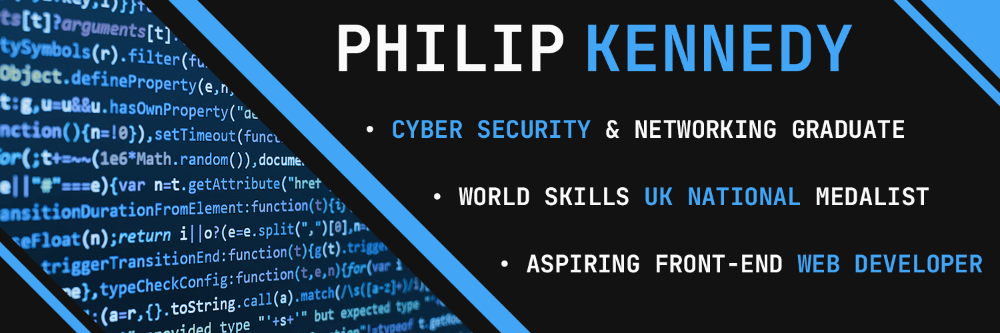

### About Me

I’m Philip from the United Kingdom, and I’m an aspiring front-end web developer. I graduated from university in the winter of 2021, achieving a BSc in Cyber Security & Networking. Therefore, this newfound passion for web development is a slight deviation from what I had initially planned – career-wise.

- 👨🏻‍💻 I’m currently working on: [freeCodeCamp](https://www.freecodecamp.org) & [Frontend Mentor](https://www.frontendmentor.io) projects.

- 🎓 I’m currently learning: **HTML**, **CSS**, and **JavaScript**.

- 🏆 Extracurricular accomplishment: I competed & placed **2nd** in the finals of the 2019 [World Skills UK National IT Support Technician Competition](https://www.worldskillsuk.org/competitions/it-support-technician/), which took place at the NEC in Birmingham, United Kingdom.

### Languages and Tools:

